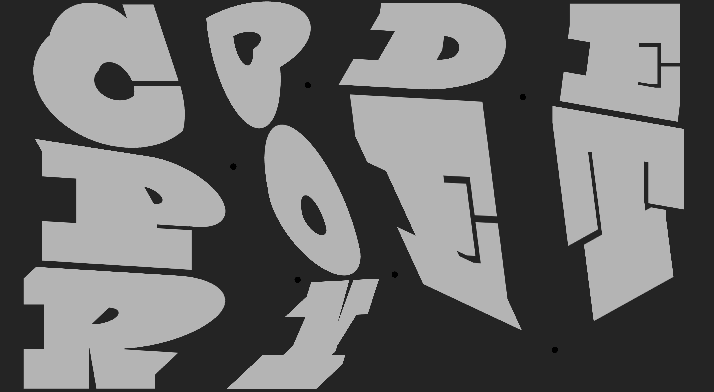

# Deform Images

A generative art project built with p5.js that allows you to interactively deform bitmap images on a grid by dragging handles.

## Description

This project creates a dynamic image display where bitmap images are arranged in a grid. You can deform the images by dragging the circular handles at the intersections of the grid lines. Images can be shuffled and uploaded.

## Features

- **Grid-based image deformation**: Drag handles to warp and distort images
- **11 built-in abstract images**: Pre-loaded colorful abstract artwork
- **Image shuffling**: Randomize the order of images in the grid
- **Custom image upload**: Add your own images (JPG, PNG, etc.)
- **Adjustable columns**: Change grid layout from 2-6 columns
- **Theme toggle**: Switch between light and dark backgrounds
- **High-res export**: Save snapshots as PNG files

## Usage

- **Drag handles**: Click and drag the pulsing circular handles to deform the image grid.
- **Toggle theme**: Press `H` to switch between light and dark themes.
- **Save snapshot**: Press `S` to save a high-resolution PNG image of the current deformation.
- **Open settings**: Click the gear icon to access the settings panel.

## Settings Panel

- **Shuffle Images**: Randomly reorder images in the grid
- **Upload Image**: Add your own images to the grid
- **Columns**: Adjust the number of columns.
